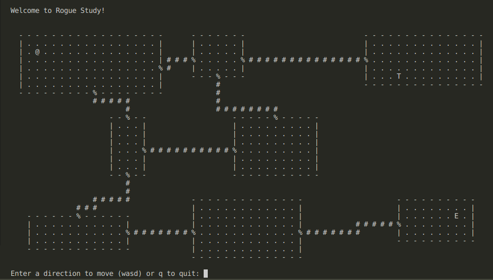

# Rogue Study

This repository is an homage to the 1980 game Rogue. The purpose of this C program is to practice making simple text games, and to ultimately port to LCC Assembly.



## About the Game

The game is a simple text-based dungeon crawler. The player moves around a grid, navigating through rooms and corridors, and interacting with doors. The game is currently in a basic state, but serves as a foundation for more complex features and mechanics.

## Building the Game

To build the game, you need to have GCC installed on your machine. Once installed, you can compile the game using the following command:

For Linux/Mac:
```bash
gcc ./maptest3.c -o ./maptest3
```

For Windows:
```
gcc .\maptest3.c -o .\maptest3
```

This will create an executable named `maptest3` in your current directory and then immediately run it.

## Running the Game

After building the game, you can run it using the following command:

For Linux/Mac:
```bash
./maptest3
```

Or on Windows:
```
.\maptest3.exe
```

## Future Plans

The ultimate goal is to port this game to LCC Assembly, as a way to learn more about low-level programming and game development.

## Contributing

Contributions are welcome! Feel free to submit a pull request.

## License

This project is licensed under the MIT License - see the [LICENSE](LICENSE) file for details.
